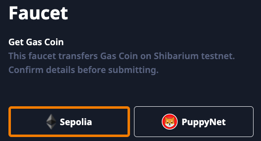

# Testnet Guide - START HERE

In order to use the product on testnet you will need to make sure you configure both Shibarium's testnet (Puppynet) and Ethereum's testnet (Sepolia). Testnet contract addresses can be found [here](../deployed-contracts/testnet.md).

Visit [https://testnet-app.k9finance.com/liquid-staking/stake](https://testnet-app.k9finance.com/liquid-staking/stake) to access the K9 liquid staking protocol and begin staking your BONE on Sepolia for knBONE on Puppynet.

#### **Step 1 - Add the following 2 testnet networks to your wallet** ([Metamask A](https://support.metamask.io/networks-and-sidechains/managing-networks/how-to-add-a-custom-network-rpc/)[dd Network Guide](https://support.metamask.io/networks-and-sidechains/managing-networks/how-to-add-a-custom-network-rpc/))  &#xNAN;**`Puppynet Network Settings`**

`Network name: Puppynet`

`New RPC URL:` [`https://puppynet.shibrpc.com`](https://puppynet.shibrpc.com)

`Chain ID: 157`

`Currency symbol: BONE`

`Block explorer URL (Optional):` [`https://puppyscan.shib.io/`](https://puppyscan.shib.io/)\
\
&#xNAN;**`Sepolia Network Settings`**

`Network name: Sepolia test network`

`New RPC URL:` [`https://sepolia.infura.io/v3/`](https://sepolia.infura.io/v3/)

`Chain ID: 11155111`

`Currency symbol: SepoliaETH`

`Block explorer URL (Optional):` [`https://sepolia.etherscan.io`](https://sepolia.etherscan.io)

#### **Step 2 - Open a new tab and visit the** [**Official BONE Testnet Faucet**](https://shibarium.shib.io/faucet) **to get free testnet BONE**

1. Connect Your Wallet
2. Select Sepolia and press Submit\
   
3. Selelct Puppynet and press Submit\
   .png>)
4. Once both are submitted, you will receive 10 testnet BONE on both Sepolia and Puppynet.
5. You will see "Added to queue" should receive your BONE within a minute or two.&#x20;
6. Import BONE (Sepolia) to your wallet with this address 0xcA94c8B16209CCBAfCFeab9D7649DdaEcD444007
7. Check your wallet on both Sepolia and Puppynet to confirm you received your testnet BONE.

**Step 4 - Open a new tab and use one of the following Sepolia ETH faucets**

* [https://faucet.quicknode.com/ethereum/sepolia](https://faucet.quicknode.com/ethereum/sepolia)
* [https://www.infura.io/faucet/sepolia](https://www.infura.io/faucet/sepolia)
* [https://www.alchemy.com/faucets/ethereum-sepolia](https://www.alchemy.com/faucets/ethereum-sepolia)

You must have ETH on Sepolia testnet to use the product so please follow the guides on each link above to receive ETH on Sepolia. Once you have confirmed your ETH balance on Sepolia, you can proceed to the next step.

**Step 3 - Open a new tab and visit the** [KNINE Testnet Faucet](https://testnet-app.k9finance.com/faucet) **to get free testnet KNINE**

1. Connect your wallet\
   
2. Make sure your wallet is connected to the Puppynet network.\
   
3. Click on 'Faucet' on the left hand navigation\
   .png>)
4. Click on the Mint button to claim your daily KNINE testnet token allocation\
   
5. Confirm the transaction in your wallet and wait until the transaction is processed.\
   
6. After completing the transaction, check the KNINE balance in your wallet. You may need to import the KNINE testnet token to your wallet with this address 0x005Ae0e01131dF3355Fa4ae170781cE44216DAf9 for your balance to appear.
7. The faucet resets every 24 hours.

**Step 4 - You can now use the K9 Finance testnet interface. Detailed guides for each found at the links below:**&#x20;

* [Liquid Staking](liquid-staking/)
* [Farming](farming/)
* [Real Yield Staking](real-yield-staking/)
* [Vesting](vesting.md) 

\
 
